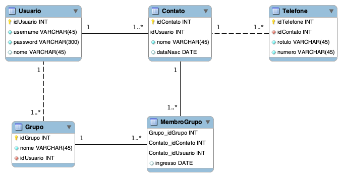

# Agenda de contatos com Flask, SQLAlchemy, Bootstrap e MySQL

Trata-se de um simples exemplo para demonstrar como fazer uma aplicação com o _framework_ Flask e algumas de suas extensões, como SQLAlchemy, Bootstrap e WTForms. 

Este projeto apresenta ainda uma ideia de organização seguindo o conceito [Blueprints do Flask](https://flask.palletsprojects.com/en/2.0.x/blueprints/) para construção de aplicações modulares.

No arquivo [agenda_contatos/\_\_init\_\_.py](agenda_contatos/__init__.py) é onde a aplicação é iniciada, os Blueprints são registrados, as extensões do Flask são ativadas. O menu de navegação Bootstrap é criado no arquivo [agenda_contatos/home/\_\_init\_\_.py](agenda_contatos/home/__init__.py).  

> A aplicação tem o básico (CRUD), porém algumas partes da aplicação precisam ser implementadas.

## Modelagem

O arquivo [banco-dump.sql](banco-dump.sql) tem as instruções DDL e DML para criar o banco. A modelagem feita com o MySQL Workbench está disponível no arquivo [modelagem.mwb](modelagem.mwb).



## Para executar a aplicação

As configurações de acesso ao banco MySQL (usuário, senha, _host_, etc) devem ser ajustadas no arquivo [.env](.env).

```bash
python3 -m venv venv
source venv/bin/activate

# para instalar os pacotes. Só é necessário fazer isso uma única vez
pip install -r requirements.txt

# para executar a aplicação
python3 app.py
```

## Para acessar a aplicação

No navegador web entre com o endereço `http://localhost:5000`. O banco conta com dois usuários para teste:

| Usuário | Senha |
| ------- | -----|
| juca    | 1234 |
| maria   | 1234 |

A senha desses usuários não foi armazenada em claro no banco de dados, mas sim o resumo criptográfico (hash) usando a função [PBKDF2](https://en.wikipedia.org/wiki/PBKDF2) provida pelo módulo [wekzeug.security](https://werkzeug.palletsprojects.com/en/1.0.x/utils/#module-werkzeug.security). Caso queira adicionar mais usuários no banco, então abra um console python3 e digite os seguintes comandos para gerar o _hash_ da senha:
```python
from werkzeug.security import generate_password_hash

senha = generate_password_hash('1234')
```

Basta agora armazenar o valor da variável `senha` no banco de dados.

## Referências

- https://flask.palletsprojects.com/en/2.0.x/blueprints/ 
- https://flask.palletsprojects.com/en/2.0.x/tutorial/ 
- https://realpython.com/flask-blueprint/
- https://docs.sqlalchemy.org/en/14/
- https://werkzeug.palletsprojects.com/en/1.0.x/utils/#module-werkzeug.security